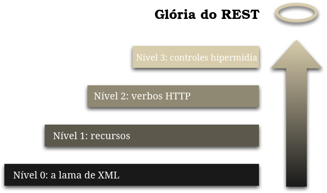

# REST

- Representational State Transfer

- model arquitectural, ou seja, não é uma technologia.

- é uma especificação que define a forma de comunicar entre componentes de software na web independente da linguagem de programação. Em outras palavras, é uma estilo arquitectura para desenvolvimento de web-services.

- Aparece no ano 2000, tese de PH (docturamento) fo cientista [Roy Fielding](https://roy.gbiv.com/). O Objectivo era a formalização de um conjunto de melhores práticas e regras para desenvolvimento de web API. 
    - https://roy.gbiv.com/
    - https://en.wikipedia.org/wiki/Roy_Fielding

- Essas melhores práticas/regras são designadas por constrains.
- Uma Rest API é uma API que segue essas melhores práticas, essas regras, definidas na tese de docturamento do Roy Fielding.


## Porquê REST?

* Separação entre cliente e servidor (entre quam consome e quem provê a API)
    * Dessa forma conseguimos ter maior flexibilidade e portabilidade.
* Os sistemas cliente e servidor podem (devem) ser completamente desacoplados e portanto podem evoluir separadamente.
* Escalabilidade, é mais facil escalagar os sistemas.
* Independência de Linguagem
* Mercado, Empresa pequenas e grandes têm contratado e fornencido cada vez mais este serviços
    * É necessário fazer integração entre sistemas, e se existe um modelo seguido por todas as empresas, ou seja, se todas as empresas seguirem o mesmo modelo arquitectural, então será teoricamente mais facil fazer a integração entre os sistemas.
    * INTERNET OF THINGS - Cada vez existem mais dipositivos a requirerem informação da Web.
    
    
## CONSTRAINTS

* Client-Server
    * Estão sempre envolvidos um cliente e um servidor.
* Stateless
    * As aplicações não devem ter estado, na prática significa que a requisição HTTP deve possuir toda a informação necessária para que seja devidamente processada.
    * O servidor não pode manter uma sessão. O servidor não mantem informações contextuais sobre o cliente.
    * Cada requisição é completamente independente das restantes, que possam ter sido feitas instantes antes.
* Cache
    * A API pode fazer cache das respostas como forma de poupar a network.
    * proxies

* Interface uniforme
    * Conjunto de e Operações bem definidas, 
    * HTTP estamos a falar dos verbos GET, POST, PUT, DELETE, PATCH, HEAD etc.
    * URIs bem definidas
    * HATEOAS

* Sistema em camadas
    * Entre o cliente e o servidor, podem existir outros servidores intermediarios, que podem fornecer aspectos como, Segurança, cache. balanciamento. 
    * Estas camandas não devem afectar a requisição do cliente nem a resposta do servidor.
    * O cliente não deve saber quantas camadas existem até chegar ao servidor, para o cliente isso não deve ser relevante.

* Código sob demanda
    * Vista como opcional e pouco utilizada.
    * O servidor pode responder um codigo (portable, por exemplo javascript) que pode ser executado no cliente. Um exemplo será o servidor enviar como resposta um script javascript o qual o cliente usará para desenhar um gráfico.


## Diferença entre REST e RESTful

Uma nota de ressalva antes de mais, **RESTful** escreve-se apenas com um `l` no final. Existe muita gente a escrever com 2, mas a forma correta é apenas com 1.

A diferença entre os dois termos é contextual e acaba por ser muito simples, mesmo assim muitas pessoas fazem confusão.

* **REST** é um estilo arquitetural que possui as CONSTRAINS que se falou no ponto anterior. Pode, portanto, ser visto como a especificação.

* Diz-se que uma **API é RESTful** quando respeita todas as CONTRAINS definidas pela especificação REST. Na Teoria uma RESTful API segue todas as CONTRAINS religiosamente, mas na prática poucas são as API que conseguem respeitar todas as regras de forma correta. Por isso o termo RESTful-API tem diferentes interpretações no mercado.

* NOTA: Se um dia alguém disser que possui uma API RESTfull, convém fazer mos uma ressalva e verificar se realmente essa API respeita todas as CONSTRAINS.

## REST APIs purista ou pragmática

No mercado podemos identificar dois tipos de desenvolvimento de APIs, as APIs puristas e as pragmáticas.

- Puristas 
    - Defendem que as CONSTRAINS definidas na especificação REST devem ser seguidas fielmente, sem exceções.

- Pragmáticas
    - Defendem uma abordagem mais prática, essas API são desenvolvidas seguindo também as CONSTRAINS, mas estão abertas exceções.  Se em um dado momento for verificado que uma determinada CONSTRAINS irá complicar todo o desenvolvimento e não agrega valor à aplicação, então a equipa opta por não respeitar essa CONSTRAIN por forma a que o desenvolvimento e uso da API seja mais simples.

### Exemplo de API 

- [Github](https://developer.github.com/v3/)

## APLICAÇÕES-HTTP-CLIENT

### [GnuTLS](https://gnutls.org/)

[GnuTLS](https://gnutls.org/) é uma app client https. Pode ser instalada através dos comandos:

Mac:

```
$ brew install gnutls
```

``` unix
$ sudo apt install gnutls-bin
```

### [insomnia](https://insomnia.rest/)
### [postman](https://www.getpostman.com/)


## Modelo de Maturidade de Richardson (RMM)



[richardson Maturity Model analise de martin fowler](https://martinfowler.com/articles/richardsonMaturityModel.html)

#### Nivel 0:

* Nivel mais rudimentar
* HTTP como um mecanismo de encapsulamento para o seu próprio mecanismo de interação remota, geralmente baseado na invocação de procedimento remoto.
* Não Usa os Verbos HTTP de forma correcta, podem ser usados exencialmente o verbos GET e POST
* Não usa o HTTP estados
* Funciona tendo o mesmo principio do Method invocation process
* Geralmente a api declara apenas uma URL, e a operação que se pretende fazer é identificada com um identificador unico ao longo do Http body.
* Na maior parte do caso são encontrados payloads no formato XML, mas isso não significa nada, pois mesmo que se use JSON ou outro qualquer formato o nivel não irá mudar.
* Não podemos chamar uma API neste nivel de REST.

#### Nivel 1:

* Quando se começam a fazer HTTP Requisition para URI que identificam recursos.
* A API não possui um unico endpoint, ao contrário do Nivel 0
* A API ainda não usa correctamente os verbos e Códigos HTTP
* Os conteudos dos body das requisições são identicos com os usados no Nivel 0


#### Nivel 2:

* Introduz a utilização do verbos HTTP de acordo com a semantica de cada um.
* Usa os codigos HTTP correctamente.
* Os payloads passam a ser representções de recursos, embora isso não interfira com o nivel da api, o que define é nivel é a utilização correcta dos verbos e codigos HTTP.
* Este é o nivel que a maioria das REST API se encontram hoje (2019-Dec-15).
* O criador do REST (Roy Fielding) não considera ainda que este nivel seja REST, mas o "mercado" já considera o nivel 2 como REST.


#### Nivel 3:

* Tambem conhecido como HETEOAS (Hypertext as the Engine Of Application State), ou seja em Portugues Hypertext como motor de estado da aplicação.
* O proposito central do HETEOAS é dizer qual é o proximo passo após um requisição em um recurso e qual é a uri desse recurso.
* Isto pode ajudar os utilizadores/clientes da API a saberem usar a API, podem ser mais "dummies".

```
HTTP/1.1 200 OK

{
    "id": 123,
    "name": "Macbook pro 13",
    "links": {
        "disable": "/payments/123",
        "supplier": "/supplier/1234"
    }
}
```

* Os links podem ser variaveis com o estado da actual do recurso, ou seja, por exemplo, se um recurso já estiver inactivo, não faz sentido enviar o link para activar, nesse caso poderia ate ser adicionado um link para activar.
* No exemplo não foi adicionado o verbo a utilizar em cada requisição, mas isso pode ser tambem adicionado, e com isso o cliente da API poderia ser completamente "ignorante" quanto a regras de negócio, apenas se preocupando com UI e formas de display.
* Roy Fielding e todos os developers "puristas", apenas consideram que uma API é REST quando atinge este nivel de Maturidade, mas atingir este nivel de maturidade pode às vezes ser dispendioso e não trazer benefícios. 

---

## Other important topics

* [Http verbs - Safe method and Idempotence Methods](/docs/Http-verbs.md)

* [Granularidade de recursos: Chatty vs Chunky APIs](docs/12.2.Granularidade-de-recursos-Chatty-vs-Chunky-APIs.md)

* [Data e Hora em REST APIs](/docs/11.6.Date-and-time-in-REST-APIs.md)

* [Spring Exception handler for Rest APIs](/docs/Spring-Tratamento-e-modelagem-de-erros-da-API.md)

* [Spring - How to join BeanValidation.properties joined with message.properties](/docs/Join-spring-message-with-bean-validations.md)