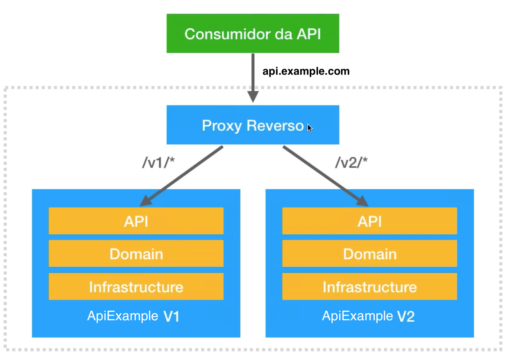
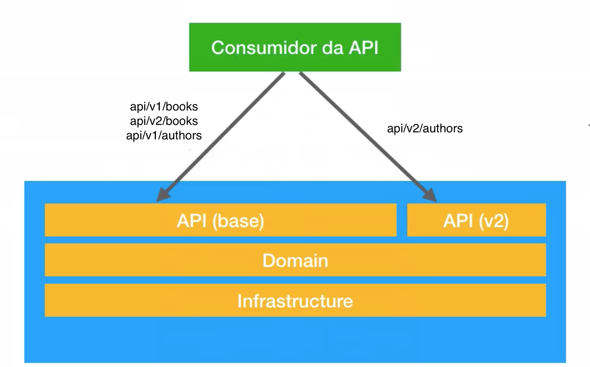
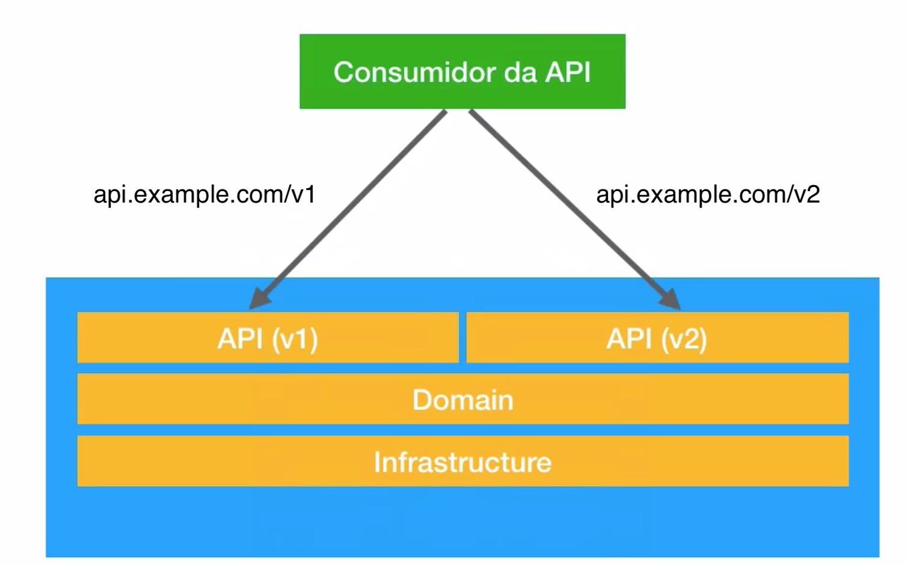

# Evolucao da API

Toda e qualquer mudança que possa fazer sobre uma API, ela pode ter uma de 2 caracteristicas:

- Retrocompatibilidade
- Quebra de compatibilidade

Portanto, antes de efectuar qualquer alterações na API, há que refectir sobre as consequencias que ela pode trazer.

## Casos problematicos

### 1. Evitar partir a compatibilidade dos clients

Deve ser evitado quebrar a compatibilidade dos clientes.
Neste pontos pretende analisar uma estrategia de como evitar quebrar a compatibilidade dos clientes sempre que se adiciona uma proprety ao Modelo.

  - Vamos supor que temos originalmente, a saida que se segue:
  ```json
  {
      "id": 1,
      "name": "John Foo",
      "tax": 12.35,
      "enabled": true
  }
  ```

  - Agora precisamos adicionar uma nova property ao modelo anterior, por exemplo `rank` e `ratting`
  
  ```
    {
        "id": 1,
        "name": "John Foo",
        "tax": 12.35,
        "enabled": true,
        "rank": 5,
        "ratting": 98
    }
  ```
    
  - Este tipo de alterações não quebra a compatibilidade, caracteriza-se então como uma alteração: `Retrocompativel`.
  - Os consumidores da API podem simplemenete ignorar a nova propriedade caso esta não lhe seja necessária.
  
Outro cenário diferente será quando por exemplo, ao payload de request por exemplo de um POST, for adicionada uma nova propriedade.
  - Esta alteração pode Quebrar a compatibilidade ou manter-se compativel.
  - A quebra da compatibilidade irá depender da forma como a API tratará o dados de entrada. Se essa propriedade for obrigatória então existirá uma quebra de compatibilidade.
  
**NOTA: Uma estrategia de migração será fazer essa alteração gradualmente, ao poucos. Isto é, primeiro educarmos os cliente a enviarem essa informação, quando os clientes estiverem a enviar essa informação a API pode efectivar a alteração.**


### 2. Exclusão de propriedade do modelo de input

Quando se pretende remover uma propriedade de uma model de input.
Devemos remover de forma gradual sempre, ou seja:

1. remover a propriedade da documentação.
2. A api continua a aceitar a entrada do Input com a propriedade.
3. Em algum momento a remoção da propriedade será efectivada.

### 3 Alteraçao de tipo de propriedade

Este é um caso de incontornavel imcompatibilidade, irá sempre quebrar o cliente.
Contudo podemos adicionar uma propriedade nova com o novo tipo e manter a mais antiga embora deprecated na documentation. Mais tarde essa old property pode ser removida. A mesma solução pode ser aplicada tanto para requests como para responses.

### 4 Alteração de URL de recurso

O cenário é o seguinte: 
A nossa API possui um endpoint no URL: `http://example.com/api/books`
A certa altura existe a necessidade de alterar esse URL para algo diferente, por exemplo: `http://example.com/api/artifacts`

Consequencias:
  - Com esta alteração todos os clientes que já estavam a utilizar essa interface, vão passar estar quebradas, irão obter como resposta o estado 404 (NOT FOUND) 

Solução:
  - Deve ser evitado a alteração de URLs sem que tal seja estritamente necessário.
  - Podemos manter os dois URLs ao mesmo tempo. O spring MVC permite tambem aceitar as duas URLs por exemplo: 
    
   ```java
   @RestController
   @RequestMapping(
           path = { "/api/books", "/api/api/artifacts" },
           produces = MediaType.APPLICATION_JSON_VALUE
   )
   public class BooksResources {
   }
   ```
        
  - A melhor forma de conseguir contornar o problema é usando `HETEOAS`, assim todos os clientes são informados automaticamente das alterações da API. No entanto para que tal seja perfeito, os clientes tambem têm de usar o `HETEOAS` dde forma disciplinada.

---

## O que é e quando versionar uma API?

  - Depois de a API já estar em production devemos ao maximo quebrar a compatibilidade.
  - Se a compatibilidade for quebrada os consumidores da API serão obrigados a fazer alterações nas suas integrações.
  - Ou seja, até para defender os interesses de business da nossa organização, devemos pensar primeiro nos consumidores da API.
  - Mas vai chegar uma altura em que seremos mesmo obrigados a fazer alterações na API, chegará um momento com alguma necessidade a qual não consiguimos ultrapassar sem fazer alterações na API.
  - Quando isso acontece temos de pensar em versionamento da API.
  
  - Não é um bom indicador a API ter muitas versões, tal facto indica aos consumidores que a API é muito volatil, e como tal pode implicar que os clientes tenham de fazer muitas ou frequentes alterações.
    - No momento de levantar a versão nova é uma boa estrategia manter a versão antiga a rodar  durante alguma tempo, isso permite aos clientes fazer a migração, e só quando todos fizerem a migração, podemos fazer "shutdown" na versão mais antiga.
    - Os consumidores regra geral tendem a retardar a migração ao maximo, normalmente migram apenas quando são obrigados ou quando a nova versão oferece alguma funcionalidade de muito valor. Isso quer dizer que, a Equipa da API poder ser obrigada a manter duas versões da API por um longo periodo de tempo.
  
  - Em sumário:
    - Devemos evitar ao maximos criar novas versões da API, pois dará muito trabalho e problemas.
    - Devemos pensar muito bem na API logo no momento da primeira versão, por forma a que tudo seja bem estruturado, e assim, futuras alerações sejam minimizadas.
    

## Tecnicas de versionamento:

Existem varias formas de manter no ar duas versões de uma API, no entanto para facilitar o exemplo vamos considerer que temos apenas uma applicação com dois controladores, uma para a version-1 e um segundo para a version-2:

```
@RestController
@RequestMapping(
        path = "api/books",
)
public class BookControllerV1 {
}


@RestController
@RequestMapping(
        path = "api/books",
)
public class BookControllerV2 {
}

``` 
---

## TIPO DE TECNICAS APPLICACIONAIS DE VERCIONAMENTO

### Tecnica 1 - Versionamento por Media Type

Enviar o numero da version no request Header `Accept`.
O Media Type `vnd.food4u.vx+json` é um media type customizado, e é uma padrão para versionamentos.

```
GET /api/books
Accept: application/vnd.food4u.v1+json


GET /api/books
Accept: application/vnd.food4u.v2+json
```

### Tecnica 2 - Versionamento por Media Type

Adicionar o numero das versions na Uri do Controladores.

Esta tecnica tem a vantagem de ser mais simples para os consumidores.

```
GET /api/v1/books
Accept: application/json

GET /api/v2/books
Accept: application/json
```

---

## ARQUITECTURAS DE VERSIONAMENTO

### Versionamento atraves de infrainstrutura



##### Caracteristicas:

  - Existe um servidor load balance publico, com a responabolidade de fazer o roteamento para o servidor da versão correcta.
  - Se o path contiver V1 o request é reencaminhado para o servidor da versão 1
  - Se o path contiver V2 o request é reencaminhado para o servidor da versão 2

##### Vantagens:

  - O source-code esta completamente separado. Ou seja, alterações de codigo na versão 1 não terão impacto na versão 2 e vice versa.
  - Os servidores podem ser parados e reiniciados individualmente sem impactos para a outra versão.
  - As versões podem estar desenvolvidas em linguagens diferentes, por exemplo a versão 1 em java e a version 2 em payton.
  - Facilita muito a manutenção de APIs.

##### Desvantagens

  - Pode existir duplicação de codigo entre as versões.


### Projecto unico com reaproveitamento de codigo.



##### Caracteristicas:

  - Manter uma unica aplicação, reaproveitando codigo da API.
  - O que for comum em ambas as versões será o mesmo controlador a responder, tanto para a versão 1 como para a versão 2.
  - O que for diferente será outro controlador criado para o efeito (ControladorV2).

##### Vantagens:

  - O business model e infratrutura source-code é compartilhado por ambas as versões.
  - Evita-se Duplicação de código.

##### Desvantagens

  - Manutenção de código mais dificil e com possiveis efeitos colaterais.
  - Alterações na versão 2 podem afectar uma versão 1 que devia ser estavel.
  - O risco é muito grande, às vezes o barato sai caro.
  - Bloqueio technologico. A stack technologica das versões tem de ser sempre a mesma.


### Projecto unico com Separação total de Versões.



##### Caracteristicas:

  - O campada de API das versões é completamente desacuplada entre versões.
  - O código de suporte (backend) é o mesmo.

##### Vantagens:

  - A implementações das versões da API são separadas, podem estar em modulos separados.

##### Desvantagens

  - Pode existir algum cogigo duplicado.
  - Alterações na versão 2 podem afectar uma versão 1 que devia ser estavel.
  - O risco é muito grande, às vezes o barato sai caro.
  - Bloqueio technologico. A stack technologica das versões tem de ser sempre a mesma.