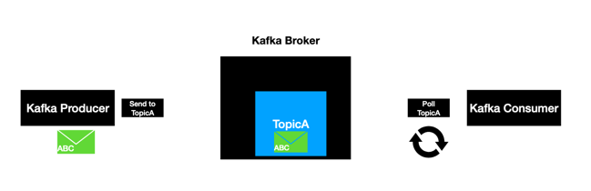
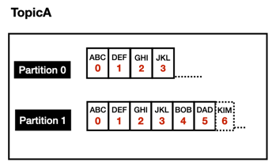

# kafka

## Event Stream platform

1. An *Even streaming platform allows* the application to produce and consume a stream of records, as like a messaging service, 
  - You can think of this as a `Pub Sub Model`.
    - The producer and consumer here are independent of each other, meaning the producer has no clue about which consumer is going to read this message.

2. An even streaming platform also *stores* the stream of events so that it can be replayed if it's necessary, events are generally retained in multiple servers for people waiting for **tolerance** and **availability**.

3. An Even streaming platform also allows the application to process the records as they occur.

👆Basically, these three principles form the foundation for the event streaming platform, Apache Kafka, build on top of these principles.

### Traditional Messaging system vs kafka

#### Traditional Messaging System

- Transient Message Persistence
  - after the message has read by the consumers, the message will be removed from the message broker. 
- Brokers are responsibility to keep tack of consumed messages.
  - and remove them from the broker when the message are read.
- Target a specific consumer, to read a message from the broker.
- Not a distributed system

#### kafka Stream platform

- Store events based on a retention time. events are Immutable, once the records are sent to kafka, then it cannot be altered.
- It is responsibility of the consumer to keep track of the consumed messages
- Any Consumer can access a message from the broker.
- It is a distributed streaming system. 
  - a distributed system in general is proven to handle the load very well and has the intelligence to distribute the Load.

## Kafka Topic and Partitions

### Topic

- It is an Entity in kafka with a name. We can think a topic like a table in a database.
- lives in general inside the kafka broker.
- topic clients uses the topic name to produce and consume messages.
  - The behavior of kafka consumer is to pull continuously for new messages.
  - The kafka produce in general produces a message into the topic, if something outside invokes a producer. but even here the producer use the topic name to push a message.
  - One quick thing to retain out here is that even though the record is read by the consumer the message still resides inside the kafka, has the defined retention time

### Partitions

- Is **where the messages lives inside the topic**.
- Each topic will be created with one or more partitions. it is pretty common practice to have more than one partition.

- each partition is an ordered, immutable sequence of records. that means once a record is produced, it cannot be changed at all.

- Each record as a sequential number associated, that number is called `offset`, the offset is generated when a record is published to the topic.
  - The offset play a very important role when it comes to consumers.

- Each partition is independent of each other and that is why we see that the offset in both partitions stars with zero and it continues to grow independently.
- Ordering is guarantted only at Partition level. If we have a use case where we would like to publish and read the records in a certain order, then we have to make sure to publish the records to the same partition.
- All records are persisted in a commit log in the file system where the kafka is installed. very simmilar to a database transactions.

### Setup kafka

- [setup v.2.x.x](docs/setup-under-3v.md)
- [setup v.3.x.x](docs/setup.md)
