# kafka


## Event Stream platform

1. An *Even streaming platform allows* the application to produce and consume a stream of records, as like a messaging service, 
  - You can think of this as a `Pub Sub Model`.
    - The producer and consumer here are independent of each other, meaning the producer has no clue about which consumer is going to read this message.

2. An even streaming platform also *stores* the stream of events so that it can be replayed if it's necessary, events are generally retained in multiple servers for people waiting for **tolerance** and **availability**.

3. An Even streaming platform also allows the application to process the records as they occur.

👆Basically, these three principles form the foundation for the event streaming platform, Apache Kafka, build on top of these principles.


### Traditional Messaging system vs kafka

#### Traditional Messaging System

- Transient Message Persistence
  - after the message has read by the consumers, the message will be removed from the message broker. 
- Brokers are responsibility to keep tack of consumed messages.
  - and remove them from the broker when the message are read.
- Target a specific consumer, to read a message from the broker.
- Not a distributed system


#### kafka Stream platform

- Store events based on a retention time. events are Immutable, once the records are sent to kafka, then it cannot be altered.
- It is responsibility of the consumer to keep track of the consumed messages
- Any Consumer can access a message from the broker.
- It is a distributed streaming system. 
  - a distributed system in general is proven to handle the load very well and has the intelligence to distribute the Load.


## Kafka Topic and Partitions

### Topic

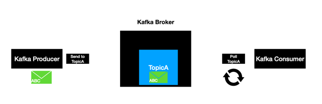

- It is an Entity in kafka with a name. We can think a topic like a table in a database.
- lives in general inside the kafka broker.
- topic clients uses the topic name to produce and consume messages.
  - The behavior of kafka consumer is to pull continuously for new messages.
  - The kafka produce in general produces a message into the topic, if something outside invokes a producer. but even here the producer use the topic name to push a message.
  - One quick thing to retain out here is that even though the record is read by the consumer the message still resides inside the kafka, has the defined retention time

### Partitions

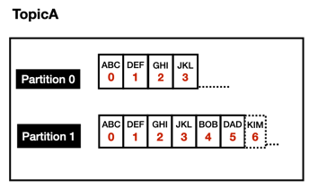

- Is **where the messages lives inside the topic**.
- Each topic will be created with one or more partitions. it is pretty common practice to have more than one partition.

- each partition is an ordered, immutable sequence of records. that means once a record is produced, it cannot be changed at all.

- Each record as a sequential number associated, that number is called `offset`, the offset is generated when a record is published to the topic.
  - The offset play a very important role when it comes to consumers.

- Each partition is independent of each other and that is why we see that the offset in both partitions stars with zero and it continues to grow independently.
- Ordering is guarantted only at Partition level. If we have a use case where we would like to publish and read the records in a certain order, then we have to make sure to publish the records to the same partition.
- All records are persisted in a commit log in the file system where the kafka is installed. very simmilar to a database transactions.


## Setup kafka

- [setup v.2.x.x](docs/setup-under-3v.md)
- [setup v.3.x.x](docs/setup.md)

## Sending Message With Key

The kafka message is composed with to things, the value and a key. The value is mandatory and the key is optional.

- We can publish message without key, but by doing that, we no guaranty of the consume order.  
  - we know that the order is only guaranteed if the messages are delivery to the same topic partition, therefore if we really want to guaranty the consumed the order we must push the messages to the same topic partition. is exactly for this use case that the key is designed for.
  - Kafka guarantee that messages with the same key are delivery to the same topic partition.

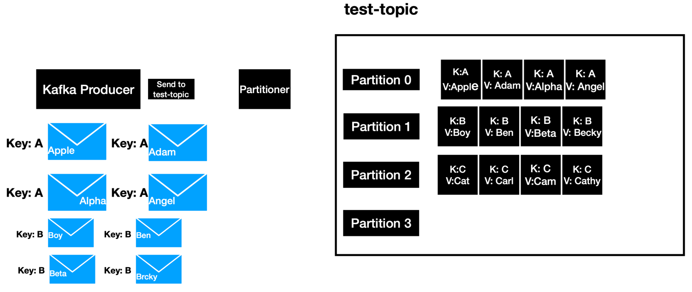


## Topic offset

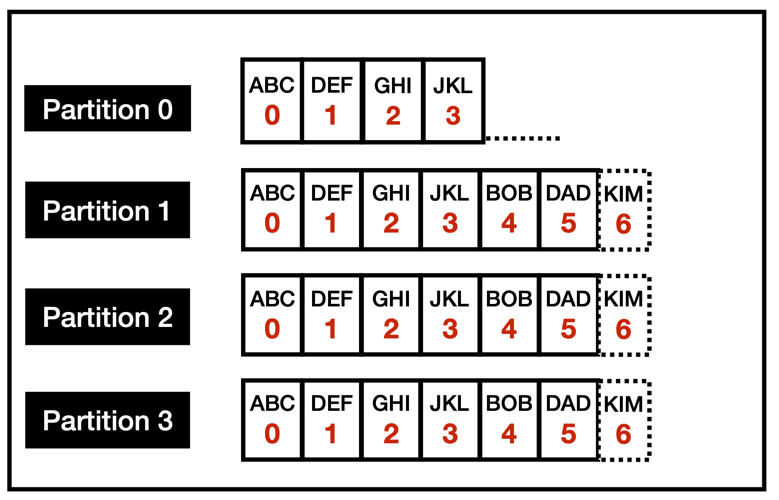

Any message that the is produced into the topic will have a unique ID call offset in the previous this ID is being represented by red color.
Consumer have 3 options when it comes to reading the messages from the topic.

- from-beginning: Since ever
- latest: Read the messages that is going to came after the consumers spam up.
- specific offset: Read the messages of the topic by passing a specific offset value from the consumer.

👆If you are building a consumer then you have all these there options. The first 2 options can be explored using the console.

- The offset of each consumer is stored in the special internal topic `__consumer_offsets`

- Consumer offsets behaves like a bookmark for the consumer to star reading the messages from the point it left off.


1. create a topic with the name 
    ```
    kafka-topics --zookeeper platform-zoo:2181 --create --topic test-topic --replication-factor 1 --partitions 4
    ```
2. producer 
    - Without Key
    ```
    kafka-console-producer --broker-list localhost:9092 --topic test-topic
    ```
    - With Key
    ```
    kafka-console-producer --broker-list localhost:9092 --topic test-topic --property "key.separator=-" --property "parse.key=true"
    ```

3. create consumer
   - Without Key
    ```
    kafka-console-consumer --bootstrap-server localhost:9092 --topic test-topic --from-beginning
    ```
    - With keys
    ```
    kafka-console-consumer --bootstrap-server localhost:9092 --topic test-topic --from-beginning -property "key.separator= - " --property "print.key=true"
    ```


## Consumer Group

- `group.id` is mandatory
- `group.id` plays a major role when it comes to scalable message consumption

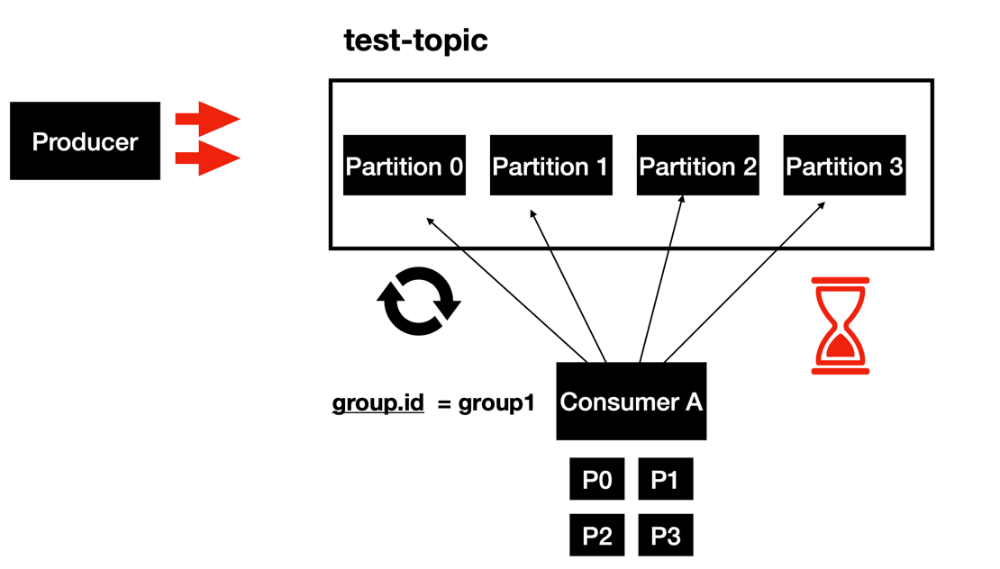

- Lets say we have a topic named `test-topic`and it has 4 partitions.
- We have a consumer with `group-id` equals to `group1`.
  - we have a single consumer pulling all the 4 partitions in the topic and processing them.
  - The pull and processing is always a single thread, so a single thread is going to pull from all the partitions.

- Imagine that, a producer is producing messages with faster rate than a the consumer processing rate.
  - Consequently, we are introducing a lag in the consumer and you might end up not processing the events in real time.

This is where the consumer groups comes, and may heps us.

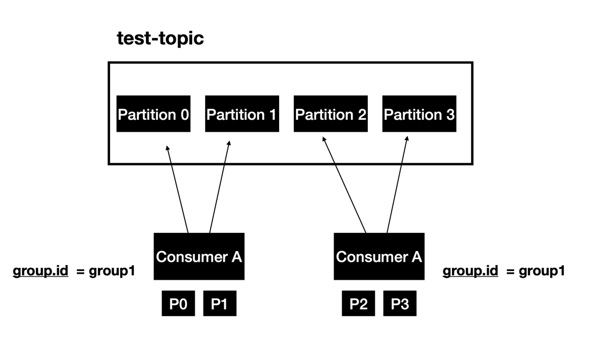

- Now lets say we spend another instance of consumer, but make sure ypu are using the same group 1.
- The partition are split between the 2 instance off  the consumer. The partition zero and one is taken care by the first instance and the partition two and three are taken care by the second instance.
- Basically what this means is that we have a scale out message consumption. This helps process the records a little faster than it was before.
- we can even make it much better by spending up with more consumer instances.

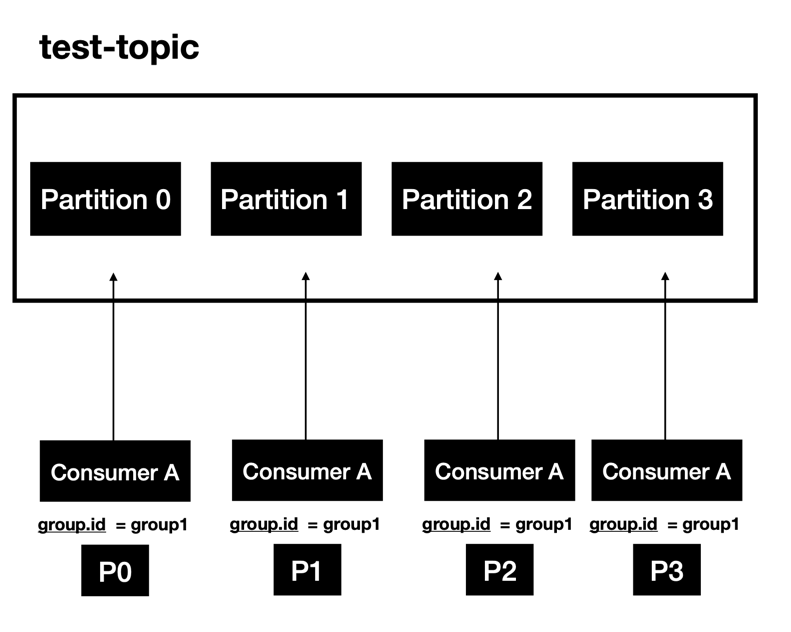

- The consumer groups are fundamentally the basic for scaling events consumption.


Now Lets say we have 5 consumer instances, but only 4 partitions are available for a given topic.

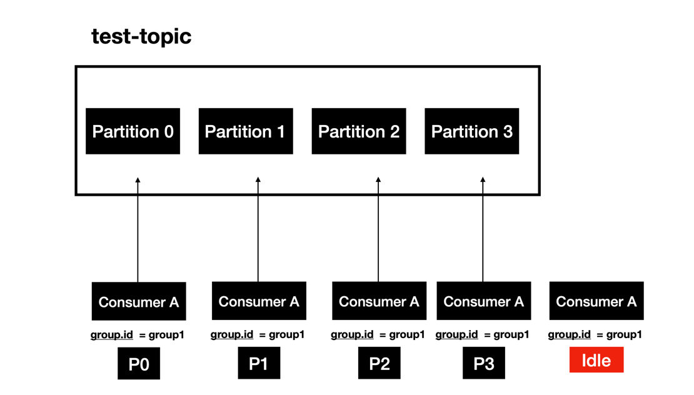

- In this case one of the consumers instance will be IDLE.

#### two different application consuming the same topic
A different common use case, is to have two different applications consuming from the same kafka topic

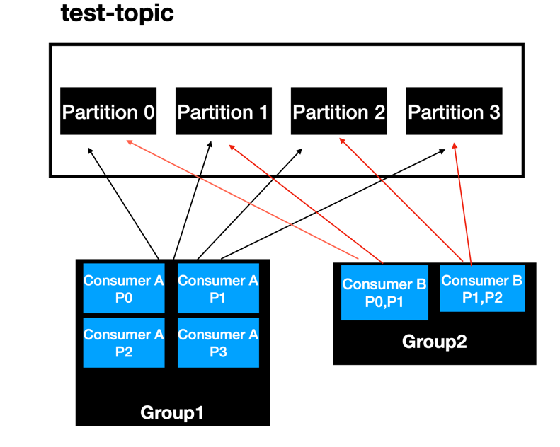

This is a pretty common scenario in a enterprise. Each consumer app will have their own processing logic. Each app can have different number of instances based on it requirements.

- In this example:

- App 1:
  - have 4 instance with `groupid=group1`,
  - means that one instance for each topic partition

- App 2:
  - have 2 instance with `groupid=group2`
  - means that one instance will consumer partition 0 and 1, and the instance 2 will consume from partition 2 and 3.

- The teams have to make sure that the apps do not use the same group id.
- This way the group id should be unique by each application.

#### Summary
- Consumer Groups are used for scalable message consumption. 
- Each different application will have a unique consumer group  
- Who manages the consumer group?
  - Kafka Broker manages the consumer-groups
  - Kafka Broker acts as a Group Co-ordinator


```
kafka-console-consumer --bootstrap-server localhost:9092 --topic test-topic --group app1
```

## Commit log & Retention Policy

One of the key qualities of kafka is the concept of retaining the records for a certain period of time. But how does it work?

Let's try to understand using a sample example diagram:

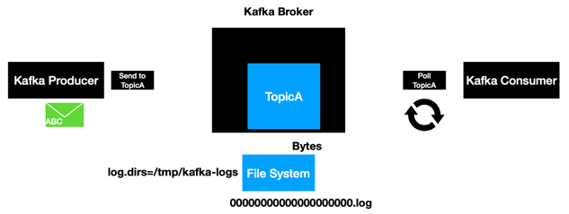

#### Commit log

1. when the produce sends a message, it first reaches the topic.
2. And then, the very thing that happens is that the record gets written to a file system in the machine.
   - The file system is where the kafka broker is installed. In this example it is our local machine. 
   - The records are always written into the file system as bytes to file system.
   - The file system where the records are written is configured in the property `log.dirs` in the kafka `server.properties` file.
3. kafka creates files with extension of `.log`, as we can see in the example diagram, we have numerous zeros followed by the `.log`.
   - Each topic partition will have it own log, means that if we have a topic with 4 partitions, then we will also have 4 log files written in the file system.
   - Just after the messages are written into the log file, that is when the records that are produced, are committed.
   - 👆That is way these log files are also called was *`partition commit logs`*
4. When the consumer who is continuously pulling for new records can only see there are records that are committed into the file system.

```shell
$ ls -la /var/lib/kafka/data

rwxr-xr-x  2 appuser appuser 4096 Dec  3 20:52 test-topic-0
drwxr-xr-x  2 appuser appuser 4096 Dec  3 20:52 test-topic-1
drwxr-xr-x  2 appuser appuser 4096 Dec  3 20:52 test-topic-2
drwxr-xr-x  2 appuser appuser 4096 Dec  3 20:52 test-topic-3


$ ls /var/lib/kafka/data/test-topic-0

00000000000000000000.log
```

#### Retention Policy

1. Retention policy is one of the key properties that is going to determine how long the message is going to be retained.
2. Retention policy is Configured using the property *`log.retention.hours`* in `server.properties file.
3. The default retention period is `168 hours` (7 days).

---

# Spring boot Kafka Template

- Produce records in to kafka topic
  - Similar to JdbcTemplate for databases

## How KafkaTemplate Works?

- [spring for kafka](https://docs.spring.io/spring-kafka/reference/html/)
- [spring for kafka](https://docs.spring.io/spring-kafka/reference/html/#reference)
- [4.1.3. Sending Messages](https://docs.spring.io/spring-kafka/reference/html/#sending-messages)


 

- kafka template is going to send the messages to a kafka topic. but being the scenes it does more interesting things during this process. It passes by some different layers before the message is sent to kafka.


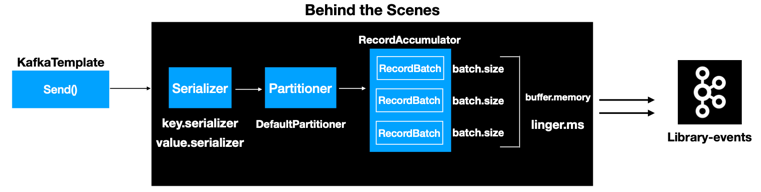 

1. The very first layers is the **`Serializer`**, any record sent to the kafka needs to be serialized to bytes.
    - There are 2 different types of serializations techniques that are applied to any record
      - key.serializer
      - value.serializer
    - This configurations is mandatory for any producer, the client needs to provider the key and value serializer types
    - The kafka client Java library comes with some predefined serializers
2. The second layer is **`Partitioner`**
   - This layers is responsible to determine for witch partition the message is going to into the topic.
   - The kafka producer api comes with a default partition logic `DefaultPartitioner`, in most case that is enough handler the partitioning logic. 
   - `org.apache.kafka.clients.producer.Partitioner`
   - `org.apache.kafka.clients.producer.internals.DefaultPartitioner`
   - `org.apache.kafka.clients.producer.RoundRobinPartitioner`
3. The third layer is the **`RecordAccumulator`**
   - Any record that is sent from the `kafkaTemplate` won't get sent to the topic immediately.
   - The `RecordAccumulator` buffers the records, 
   - The records are sent to the kafka topic once the buffers full.
   - The reason for this approach is to limit the number of Threads from the application to the kafka cluster, and this eventually avoids the overhead of bombarding the cluster but numerous request, which also helps improving the overall performance of the system.
   - The `RecordsBatch` represented in the previous image, is a representation of the topic partition combination, if we have a topic with 3 partitions, then we will have 3 `RecordBatch`.
   - Each `RecordsBatch` has a `batch.size`, it value is represented by number of bytes.
   - It also has a overall buffer memory, which is represented by the property `buffer.memory`, it value is also represented has number of bytes.
   - What scenarios, the messages are send to the topic?
     - Once the RecordsBatch is full, then the message will be sent to the topic.
     - The producer api is not going to wait for so long to send the message to the topic. There is also another handy property called `linger.ms`, which will be used in the case to publish, it values represents numeric value (millisecond), it the batch is not full and the records accumulated, meet the linger.ms value, then the records are sent to kafka topic.


## Configuring KafkaTemplate

*Mandatory Values*
```
bootstrap-servers: localhost:9092,localhost:9093,localhost:9094 
key-serializer: org.apache.kafka.common.serialization.IntegerSerializer 
value-serializer: org.apache.kafka.common.serialization.StringSerializer
```

*KafkaTemplate AutoConfiguration*
```yml
spring:
  profiles: local 
  kafka:
    producer:
       bootstrap-servers: localhost:9092,localhost:9093,localhost:9094 
       key-serializer: org.apache.kafka.common.serialization.IntegerSerializer 
       value-serializer: org.apache.kafka.common.serialization.StringSerializer
```

- `org.springframework.boot.autoconfigure.kafka.KafkaAutoConfiguration`

# KafkaAdmin

- Create topics programmatically, allow us to create topic from our code, this is not recommended for productions environments.
-part of **`SpringKafka`**
- How to create topic from code?
  - we need to create two beans
    1. Create a Bean of type `KafkaAdmin` in SpringConfiguration
    2. Create a bean of type `NewTopic` in SpringConfiguration
