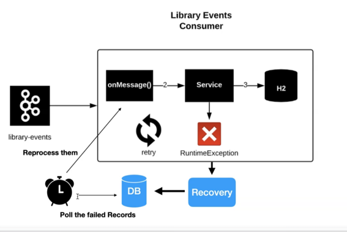

# Recovery Save the failed message to the DB

### we want to In the consumer: 

1. persist the failed messages to the database
2. to have a scheduler to republish the messages from the db to the original topic
