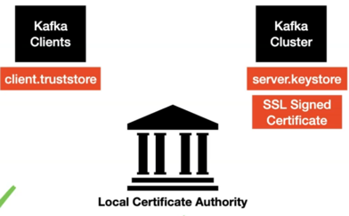

# Kafka security

Kafka supports two popular protocols:

- **`SSL`** (Security Socket Layer), which is TLS (Transport layer security) now

- **`SASL`** (Simple Authentication and Security Layer)


## SSL

This protocol is used for example in https

- SSL is used for two things
  - Encryption
  - Authentication

### SSL set up steps

The kafka official documentation tells us how to configure the all thing:
https://docs.confluent.io/platform/current/kafka/authentication_ssl.html

- [commands](docker-composes/ssl/Kafka_Security.md)
- [commands](https://github.com/confluentinc/confluent-platform-security-tools)

```sh
export COUNTRY=PT
export STATE=PT-06
export ORGANIZATION_UNIT=SE
export CITY=PP
export PASSWORD=secret
```



### 1. Generate server.keystore.jks
- KeyStore in general has information about the server and the organization

```sh
      keytool -keystore server.keystore.jks -alias localhost -validity 3650 -genkey -keyalg RSA
```

```sh
$ keytool -keystore server.keystore.jks -alias localhost -validity 3650 -genkey -keyalg RSA

Enter keystore password:  
Re-enter new password: 
What is your first and last name?
  [Unknown]:  localhost
What is the name of your organizational unit?
  [Unknown]:  localhost
What is the name of your organization?
  [Unknown]:  localhost
What is the name of your City or Locality?
  [Unknown]:  Pouca Pena        
What is the name of your State or Province?
  [Unknown]:  PT-06
What is the two-letter country code for this unit?
  [Unknown]:  PT
Is CN=localhost, OU=localhost, O=localhost, L=Pouca Pena, ST=PT-06, C=PT correct?
  [no]:  y

```

👆This will generate a file in your working directory `server.keystore.jks`

To see the content in side of the generate keystore file:
```sh
keytool -list -v -keystore server.keystore.jks
```
     
Notes:     
  - `first and last name`: is equivalent to the actual domain name, if you think about `Amazon.com`, you will give "Amazon.com" in the place of the first and last name. 

### 2. setup local certificate authority

Basically, the reason why we are doing this, is because we are generating the SSl Certificate by ourselves, because we are just running this up in our local environment.
If you are doing this step for a enterprise, you don't have to do this stuff at all because there are some approved certificate authorities outside to which we will request  a signed certificate.

```shell
openssl req -new -x509 -keyout ca-key -out ca-cert -days 3650 -subj "/CN=local-security-CA"
```

```output
Generating a 2048 bit RSA private key
.......................................................................+++
..................+++
writing new private key to 'ca-key'
Enter PEM pass phrase:
Verifying - Enter PEM pass phrase:
```

- we are using the openssl, and what we doing is request a new ca-key and ca-cert providing the number of days that the cert is going to be active `-days 3650`, and the name of the certificate authority `-subj "/CN=local-security-CA"`, so `local-security-CA` is our fake certificate authority.

- As you can see by the command output, we are generating a private key. Normally, private keys is something which we will keep it to our selves, we will never share it to the outside world.

- The command will generate two new files, `ca-cert` and `ca-key`.
  - ca-key: is a private key, that should never be shared to the outside world.
  - ca-cert:


### 3. create CSR (certificate signing request)

```shell
keytool -keystore server.keystore.jks -alias localhost -certreq -file cert-file
```

we must provide the keystore file generated in the first step. 
The output of the command will generate a file named as `cert-file` witch is the certificate signing request file.


### 4. sign the SSL certificate

- The below command takes care of signing the CSR, and then it spits out a file **cert-signed**

```
openssl x509 -req -CA ca-cert -CAkey ca-key -in cert-file -out cert-signed -days 3650 -CAcreateserial -passin pass:secret
```

- To view the content inside the file **cert-signed**, run the below command. we are providing the pass that we have used in the previous steps `-passin pass:secret`

```
keytool -printcert -v -file cert-signed
```

This will create one more file `cert-signed`.


### 5. Add the signed SSL certificate to server.keystore file

```shell
keytool -keystore server.keystore.jks -alias CARoot -import -file ca-cert

keytool -keystore server.keystore.jks -alias localhost -import -file cert-signed
```

The first command is just to **Add the signed SSL certificate to server.keystore file**
And the second command is to add cert-signed

### 6. Configure the SSL cert in our kafka broker

- this properties should be putted inside kafka server.properties config file. which is inside the config directory. 

```
ssl.keystore.location=<location>/server.keystore.jks
ssl.keystore.password=secret
ssl.key.password=secret
ssl.endpoint.identification.algorithm=
```

- note that the `ssl.endpoint.identification.algorithm` is defined as empty value, this is because by default it is enabled with https, so if you intend to run it in local, you don't need it


- Now we need to take care of some configurations.

The listeners are just plain text, you must create a new listener type, you need to provide SSL network port `SSL://localhost:9095` please just be careful, choose a port number that is not is being used, for example 9095.

```
listeners=PLAINTEXT://localhost:9092, SSL://localhost:9095

auto.create.topics.enable=false
```


### 7. create client.truststore.jks for the client

- The below command takes care of generating the truststore for us and adds the **CA-Cert** in to it.
- This is to make sure the client is going to trust all the certs issued by CA.

```
keytool -keystore client.truststore.jks -alias CARoot -import -file ca-cert
```

This file is need it for client validation. when the connection is made from the kafka client to the kafka cluster it is going to present the as certificate.

in the browsers is not necessary, but that is not the case on kafka clients.
