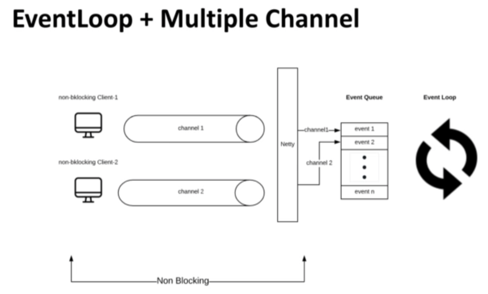

## netty


- Netty is an asynchronous event-driven network application framework for rapid development of maintainable high performance protocol server & client.
- Netty is built in top of java

### who uses Netty

- Facebook
- Google
- Instagram
- Twitter
- Apache Cassandra
- etc.

- All this companies use Netty for it internal communications.

### Protocols Supported

- FTP
- HTTP
- SMTP
- WebSocket
- etc.

### Netty - Asynchronous

```
                      ----- Request -----> 
Non-Blocking Client                        Netty
                      <----- Future ------
```

Whenever you make a call to the server for data or trying to post some data to the server, what do you get in response is the future.  
Basically the future is a reference for something that is certain to be executed and the response from  the server will be received later.  

#### Advantage

- Free us from blocking calls.
- Handles large number of http connections.

#### Events Driven in Netty

- Client requesting for a new connection is treated as an event.
- Client requesting for data is treated as an event.
- Client posting for data to the server is treated as an event.
- Errors are treated as events
  - Event the errors that happen after the connection is established is also treated as an event.

#### Netty Specific terminologies

- ###### Channel
    - Represents the open connection between the client and server.
  - We can think the channel is like a tunnel.
  - The interaction between the client and server happens using the channel.
   
  - When a channel is created, and it is active, is when the client and server can interact.
  - The Events that goes from the client to the server are called **Inbound Events**.
  - The Events that goes from the server to the client are called **Outbound Events**.

  - E.g.
    - Inbound events:
      - Requesting for data 
      - Posting data 
    
    - Outbound events:
      - Opening or closing a connection
      - Sending response to the client
  
  - When events are received by the server it is handler by the **Event Loop**.

- ###### Event Loop
  - The primary purpose is to Loop the looks for events and execute then.
  - Event Loop is registered with a **single** dedicated thread.
    - Event Loop has one associated track.
    - That is all it gets to execute all the events that is going to the server.




- ###### EventLoop

  - Is it possible to have more than one eventLoop?
    - yes.
    - The number of event loops for a given netty server is equals to two times the number of processors that are available for a given virtual machines.
    - Nº of EventLoops == 2 * Nº processors for the virtual machine.
  
  - How to calculate the number of processors that are available for a given machine?
    - `Runtime.getRuntime().availableProcessors()`

  - How many threads are available for netty?
    - Number of Threads == 2 * Nº processors for the virtual machine.
  

- You should read Netty in Action Book


## Exception handler


consider the following code, that throw an exception when is executed:
```java
@GetMapping("/runtime-exception")
public Flux<Item> runtimeException() {
    return repository.findAll()
                     .concatWith(Mono.error(new RuntimeException("some error!")));
}
```

we can invoke the code using a curl command:

```shell
curl -L -X GET 'http://localhost:8080/v1/items/runtime-exception'
```

By default, spring already have an error handler for all the exception that return a 500  status code, but in many situations we may want to override the default behaviour:


### Approach 1 - At controller level using @ExceptionHandler

Implements a exception handler at controller level:

```java
@ExceptionHandler(RuntimeException.class)
public ResponseEntity<String> handlerRuntimeException(RuntimeException exception) {
    log.error("Exception caught in handlerRuntimeException : {}", exception.getMessage(), exception );
    return ResponseEntity
               .status(HttpStatus.SERVICE_UNAVAILABLE)
               .body(exception.getMessage());
}
```

### Approach 2 - Globally using @ControllerAdvice


```java
import org.springframework.web.bind.annotation.ControllerAdvice;
import org.springframework.web.bind.annotation.ExceptionHandler;

@Slf4j
@ControllerAdvice
public class ControllerExceptionHandler  {

    @ExceptionHandler(Exception.class)
    public ResponseEntity<?> handlerUnhatchedException(Exception exception) {
        log.error("Attention: handler Unhatched Exception: {}", exception.getMessage(), exception);

        return ResponseEntity.status(HttpStatus.INTERNAL_SERVER_ERROR)
                             .body(Problem.of("123-500", exception.getMessage()));

    }

    @ExceptionHandler(RuntimeException.class)
    public ResponseEntity<?> handlerRuntimeException(RuntimeException exception) {
        log.error("Exception caught in handlerRuntimeException : {}", exception.getMessage(), exception );
        return ResponseEntity
                .status(HttpStatus.SERVICE_UNAVAILABLE)
                .body(Problem.of("123-503", exception.getMessage()));
    }
}

```


## Handling Exceptions in WebFlux - RestController - Hands On


There is a class `DefaultErrorWebExceptionHandler` that is responsible to deal with the errors. 
we can override this class to customise the default behaviour!

```java
@Slf4j
@Component
public class FunctionalErrorExceptionHandler extends AbstractErrorWebExceptionHandler {


    public FunctionalErrorExceptionHandler(ErrorAttributes errorAttributes,
                                           ApplicationContext applicationContext,
                                           ServerCodecConfigurer serverCodecConfigurer
                                           ) {
        super(errorAttributes,
                new ResourceProperties(),
                applicationContext);
        super.setMessageWriters(serverCodecConfigurer.getWriters());
        super.setMessageReaders(serverCodecConfigurer.getReaders());
    }

    @Override
    protected RouterFunction<ServerResponse> getRoutingFunction(ErrorAttributes errorAttributes) {
        return RouterFunctions
                .route(RequestPredicates.all(), this::renderErrorResponse);
    }

    private Mono<ServerResponse> renderErrorResponse(ServerRequest serverRequest) {
        Map<String, Object> errorAttributes = getErrorAttributes(serverRequest, false);

        log.info("renderErrorResponse: {}", errorAttributes);

        return ServerResponse.status(HttpStatus.INTERNAL_SERVER_ERROR)
                .contentType(MediaType.APPLICATION_JSON)
                             .body(BodyInserters.fromObject(errorAttributes));
    }
}

```
